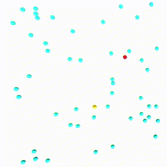

# Airport network epidemic 🦠
*By Marcus Aas Jensen*

Old school project about modeling an epidemic in the context of the COVID-19 situation. 
I choose to simulate an epidemic inside an airport network using the Unity 3D engine.

>*DISCLAIMER - This project is old (2021) and is not an accurate depiction of a real world epidemic.*
>
>*ARCHIVED - Although you can try the final version in the latest release, the final project itself was lost.
>You can only access this old project version on GitHub with other added scripts that were only present in the newer lost project.*

# Simulation
## Parameters ⚙️
**🦠 Chance of Airplane Getting Virus (0 to 1):** probability that an airplane becomes contaminated with the virus.

**∆T Virus Infection Delta T (in days):** time before a new airplane contamination occurs at a contaminated airport.

**🛫 Number of Airports:** total number of airports connected as a complete graph in the simulation.

**🧼 Chance of Cleaning the Virus (0 to 1):** effectiveness of cleaning measures at airports.

**😷 Chance of Cleaning During Lockdown (0 to 1):** increased effectiveness of cleaning measures during a lockdown situation.

**∆T Cleaning Delta T (in days):** time a new cleaning session.

## Legend 🖼️
🟦 : clean

🟨 : in danger of being contaminated

🟥 : contaminated

⬛ : airport lockdown

## Demo 🎥
Here is a *cliché* simulation of an epidemic with 30 connected airports. 
The virus is extremely contagious everyday and cleaning measures are negligeable during an unknown epidemic. When an airport is in lockdown, cleaning measures are taken seriously.

# Acknowledgments

Thank you to my professor Mr. Donati for assisting the project's evolution.

Props to my dear friend [@marcpinet](https://github.com/marcpinet) for being part of the student group.
He also made an awesome epidemic modeling project using python which was also part of the bigger picture of our presentation: [epidemic-modeling](https://github.com/marcpinet/epidemic-modeling).
